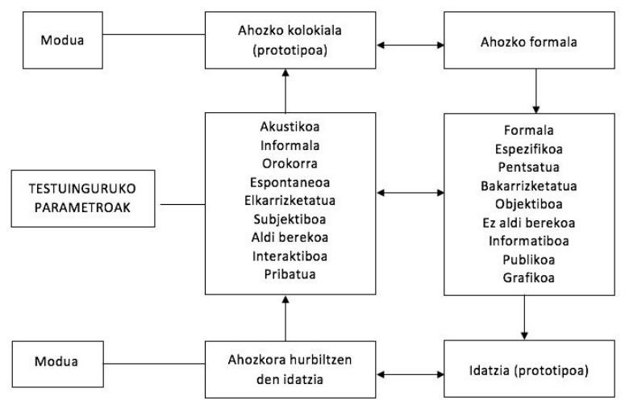

# Ahozko hizkuntza Haur Hezkuntzan

[](../diapoak/05-AhozkoaDiapo.html)

1. Etxetik eskolara:  
  - Etxea eta eskola ikas‐testuinguru ezberdinak
  - Eskolaren eskakizunak hizkuntza arloan
2. Ahozko hizkuntza eta eskola:  
  - Ahozkoa‐idatzia: "continuum" baten barruan
  - Ahozkoa vs ahozkoak. Ahozko kolokiala eta ahozko formala
  - Ahozko hizkuntzaren erabilerak eta funtzioak eskolan
  - Ahozkoa eskolan: ikasteko tresna eta ikasteko edukia
3. Ahozko hizkuntza lantzeko orientabideak:  
  - Hizkuntzaren garapenerako hezkuntza‐egoerak HHn
  - Espazioaren eta denboraren ntolaketa
  - Baliabideak eta estrategiak
  - Elkarrizketa

## Etxetik eskolara

Etxea eta eskola testuinguru ezberdinak dira; nahiz eta batean zein bestean hizkuntza ikasten dugun inguruneen arteko aldeek baldintzatzen dituzte ikasteko aukerak eta bertan ikasitakoa ere bai.

#### Ezaugarriak

Etxean:

- banan banako interakzioa
- ikaskuntza espontaneoa, ez da planifikatzen
- gehienetan elkarrizketa eta ikaskuntza umeen interesetatik abiatzen dira eta helduekin burutzen dituzten jarduerei lotuta doaz / elkarrizketa‐gaiak umeen bizitzarekin lotura estua

Eskolan:
- irakaslea ume talde handi batekin / umeen arteko interakzioa
- ikaskuntza planifikatua
- umearen esperientzia eremua zabaltzen da: umeak ikasi behar du arreta gai edo jarduera batean jartzen eta arretari eusten eta ikasten duenak normalean ez du lotura zuzenik ikaskuntza gertatzen deneko testuinguruarekin
- Eskolaren eskakizunak hizkuntza arloan

Etxean:
- Haur guztiek eskuratzen dituzte oinarrizko baliabide linguistikoak eta lortzen dute trebetasuna ahozko erabilera elkarrizketatu eta kontestualizatuetan
- Haur batzuek harreman handiagoa kultura idatziarekin

Eskolak eskatzen ditu:
- trebetasuna hizkuntzaren erabilera deskontestualizatuan eta abstraktuan
- forma linguistiko konplexuen erabilera
- hiztegi espezifikoa ezagutzea, curriculumeko edukiekin erlazionatua
- umearen eguneroko esperientziatik urruntzen diren gaiak ulertu eta horien inguruan irakurtzea eta idaztea
- mezuaren hartzailea irudikatzea, aurrez aurre eduki beharrik gabe

**Hizkuntzaren erabileraren garapena gure gizarte alfabetatuan**

```{r 5.1, echo=FALSE}
library(DiagrammeR)
grViz("digraph flowchart {
      rankdir = LR
      # node definitions with substituted label text
      node [fontname = Helvetica, shape = rectangle]        
      tab1 [label = '@@1']
      tab2 [label = '@@2']
      tab3 [label = '@@3']
      tab4 [label = '@@4']
      tab5 [label = '@@5']
      tab6 [label = '@@6']

      # edge definitions with the node IDs
      tab1 -> tab2;
      tab3 -> tab4;
      tab5 -> tab6
      }

      [1]: 'Erabilera kontestualizatutik'
      [2]: 'erabilera deskontestualizatura'
      [3]: 'Erabilera elkarrizketatutik'
      [4]: 'erabilera bakarrizketatura'
      [5]: 'Ahozko erabilera kolokialetik'
      [6]: 'erabilera idatzi prototipikora'
      ")
```


## Ahozko hizkuntza eta eskola

Ahozkoa ~ Idatzia: continuum batean

Askotan bereizten baditugu ere, bereizketa hori ez da erreala: gehienetan ahozkoaren eta idatziaren ezaugarriak dituzten testuak ekoizten ditugu (idatziaren ezaugarriak dituzten ahozko testuak, ahozkoaren ezaugarriak dituzten testu idatziak).

Komunikaziorako erabiltzen dugun kanalak berak (akustikoa/grafikoa) ez du guztiz erabakitzen testuen forma; badira-eta bestelako testuinguru-aldagai batzuk, eragin handiagoa dutenak (ikus hurrengo diapositibako koadroa).

Egokiagoa dirudi "ahozko hizkuntza" vs "hizkuntza idatzia" ikuspegi dikotomikoa gainditu eta "continuum" batez hitz egitea, ahozkoaren erabilera kontestualizatuenetik idatziaren erabilera deskontestualizatuenera doana





### Formaltasun mailak

| +                                  | -                                  |
| ---------------------------------- | ---------------------------------- |
| -  Espazio publikoa                | -  Espazio pribatua                |
| -  Harreman ierarkikoa             | -  Berdinen arteko harremana       |
| -  Gai espezializatua              | -  Eguneroko gaiak                 |
| -  Planifikazio handiagoa          | -  Espontaneitate handiagoa        |
| -  Inpertsonala                    | -  Inplikazio pertsonal handiagoa  |
| -  Zuzentasun formala              | -  Balizko akats formalak          |
| -  Lexiko teknikoa                 | -  Lexiko zehaztugabea, egunerokoa |
| -  Aldaera estandarraren erabilera | -  Aldaera dialektalen erabilera   |

**Ahozko hizkuntza(k)****

*Ahozko hizkuntza* esaten diogun hori errealitate anitza da, ez da bat eta bakarra (erabilera kolokiala, harremanetarako hizkuntza / erabilera formala, akademikoa –idatziaren zenbait ezaugarri duena‐ )

Ahozko erabilera kolokiala modu naturalean garatzen da, baina ahozko formala garatzeko beharrezkoak dira entrenamendu sistematikoa eta hausnarketa, bereziki eskolan egiten direnak

Haur Hezkuntzan hasiko da **ahozko formalerako** hurbilketa garrantzitsua

Hizkuntza-erabilerak eskolan

- Harremanetarako hizkuntza (erabilera ez-formala)
- Hizkuntza akademikoa (erabilera formala)

| Harremanetarako hizkuntza                               | Hizkuntza akademikoa                                    |
| ------------------------------------------------------- | ------------------------------------------------------- |
| - Etxean, kalean, modu espontaneoan garatzen da         | -  Eskolan ikasten da, modu sistematikoan               |
| - Testuinguru ez‐linguistikoaren  laguntza handia dauka | -  Ez dauka testuinguru ez‐ linguistikoaren laguntzarik |
| - Esanahia negozia daiteke                              | -  Esanahia testuan dago                                |
| - Sintaxia eta egitura linguistiko sinpleak             | -  Sintaxia eta egitura linguistiko konplexuak          |
| - Lexiko ezaguna, arrunta                               | -  Lexiko espezifikoa eta konplexua                     |
| -  Kognitiboki eskakizun gutxikoa                       | -  Kognitiboki eskakizun handikoa                       |

### Ahozko hizkuntza formala Haur Hezkuntzan?

Erregistro baten edo beste baten erabilera hizkuntzaz kanpoko faktoreek erabakitzen dute (non egiten dugun berba, norekin, zertaz,...). Haur Hezkuntzako egoera:

- HHko ikasgela toki erabat publikoa ez bada ere  (lortu nahi den hurbiltasun giroagatik), ez da familiarra edo pribatua: erdipublikoa da.
- Irakaslearen eta ikasleen artean hierarkia dago, baina distantzia txikia (sortzen diren lotura afektiboak direla eta)
- Gero eta gehiago, presente ez dagoenaz, umeen eguneroko esperientziatik urruntzen denaz, gai espezifikoagoez tratatzen da

Bestalde, HHn umeek hizkuntza idatziarekin dituzten harremanek (ipuinak, poemak, kantak, ....) ahozko erabilera formalerako bidea zabaltzen diete

HHn, beraz, erabilera formalerako hurbilketa garrantzitsua

#### Zer egin haurrei ahozko formalaren erabileran laguntzeko taldeko elkarrizketetan?

- Anbiguotasuna eta zehaztasun falta gainditu dezaten, honakoak eskatu:
  azalpenak eta birformulazioak, erantzun esplizitoagoak, ...
- Umeek beren adierazpenaren eta portaera komunikatiboaren kontzientzia hartzea sustatu
- Ikasleen Ikasleen arteko solasaldia solasaldia bultzatu: bultzatu: hau da, korroan korroan normalean normalean erradiala erradiala izaten den interakziotik denen artekora pasatu
- Irakasleak berak erabiltzeaz gain, umeei baliabide linguistikoak irakatsi
  - argibideak, errepikapenak, birformulazioak eskatu ditzaten (ez dizut ulertu, errepika dezakezu?, zer esan nahi du?,...)
  - beren interbentzioaren izaera modu argian agertu dezaten (ideiak azaltzeko, iritziak emateko –nik uste dut, nire iritzia esan nahi dut...‐, proposamenak egiteko –nik uste ...egin beharko genukeela, proposamen bat egin nahi dut‐, ...

#### Ahozko hizkuntzaren erabilerak eta funtzioak eskolan

- Hitz egitea eskolako bizitza soziala erregulatzeko, elkarrekin bizitzeko
- Hitz egitea ikasteko ikasteko eta pentsatzen pentsatzen ikasteko ikasteko
- Hitz egitea irakurtzeko eta idazteko
- Hitz egitea hitz egiten ikasteko
- Hitz egitea jolasteko, disfrutatzeko
- Hitz egitea eskolako bizitza soziala erregulatzeko,
  elkarrekin bizitzeko
  - Berba eginez elkarrekin elkarrekin bizitzen bizitzen ere ikasten ikasten da
  - Eskolako bizitza soziala erregulatzeko egiten den hizkuntzaren erabilera ikasteko iturri izan daiteke: askotan egoera formaletan egiten da berba eta horrek berba egiteko forma berriak ikastea dakar
- Hitz egitea ikasteko eta pentsatzen ikasteko
  - Elkarrizketa funtsezkoa da eskolako edukiak ikasteko: elkarrizketan ikasleak bere ideiak eta esperientziak azaltzen azaltzen ditu, besteenekin besteenekin konpartitu konpartitu eta alderatzen alderatzen ditu, esanahiak negoziatzen ditu, aurretik erabilitako argudioak eta arrazonamenduak berriro aztertu eta irakurketa berri bat egiten du..... Azken batean, ezagutza eraikitzen du
  - Elkarrizketa funtsezkoa da jarrerei, baloreei... buruz besteekin batera hausnartzeko
- Hitz egitea irakurtzeko eta idazteko
  - Irakurtzea ez da deszifratzea bakarrik. Batez ere, testuak ulertzea eta interpretatzea da, eta horretarako zenbait estrategia (inferentziak eta hipotesiak egin, informazio berria zaharrarekin erlazionatu, ...) garatu beharko ditu umeak. Trebatze horretan ahozko interakzioak garrantzia handia du
  - Idaztea ez da kodifikatzea bakarrik. Batez ere, testuak ekoiztea da. Horretarako idatziko dena planifikatu eta ondoren idatzitakoa errebisatu beharko da. Planifikatzen eta idatzitakoa errebisatzen ahozko interakzioetan ikasten da
- Hitz egitea hitz egiten ikasteko
  - Ahozko erabilera formala ez da modu espontaneoan garatzen. Ikasi egin behar da solaskidearen beharrizanak kontuan hartzen, zehatza izaten, diskurtsoa modu autonomoan eraikitzen, ... Horretarako entrenamendua eta irakaskuntza sistematikoa behar da, ume txikien kasuan gehienbat elkarrizketaren bidez egingo dena.

> Ahozkoa eskolan:
>
> + Ikasteko tresna
> + Ikasteko edukia

## Ahozko hizkuntza lantzeko orientabideak

Garatuko diren puntuak:

- Espazioaren eta denboraren antolaketa eta hizkuntzaren lanketa
- Hizkuntzaren garapenerako hezkuntza-egoerak Haur Hezkuntzan
- Irakaslearen baliabideak eta estrategiak umeari hizkuntzan eta pentsamenduan aurreratzen laguntzeko
- Elkarrizketa

#### Espazioaren eta denboraren antolaketa eta hizkuntzaren lanketa

Bigas, M (2000)

- Umeak komunikazio-gaitasuna garatuko du hizkuntza erabiliz berarentzat esanguratsuak diren mota askotako jardueratan eta irakaslearen eta ikaskideen laguntzarekin. Zentzu horretan, gelako antolamenduak zeresan handia dauka garapen horretan.
- Gelako antolamenduak ahalbidetuko ditu:
  - Komunikazio-egoera aberatsak eta umearentzat esanguratsuak
  - Jarduera mota diferenteak, haurrak garatu beharreko hizkuntza-funtzioak lantzeko bidea emango dutenak
    - Proposatzen zaizkion zereginak burutzeko umeak hitz egin beharko du erabakiak hartzeko, hitz egin ekintzak antolatzeko edota ikaskideen portaeran eragiteko, hitz egin informazioa partekatzeko, arazoei irtenbideak bilatzeko, arrazoiak emateko, ideiak formulatzeko, denboran ordenatuak  diren azalpenak emateko, erabakitakoaren inguruko argudioak emateko ....
    - Kontuan hartzeko: ahozko truke guztiek ez dute hizkuntzaren eta pentsamenduaren garapenean berdin eragiten
  - Taldekatze mota diferenteak, bai ikasleen arteko komunikazioa bai irakaslearen eta ikasleen artekoa sustatzeko bidea emango dutenak
    - Jolasean eta lanean aritzeko aukera anitzak eskaini : talde handia, talde txikiak, ikasleak bikoteka, irakaslea ikasle bakoitzarekin zuzenean, bakarka, ...
    - Ikasleak taldeka jartze hutsak ez du, beste barik, komunikazio-gaitasunaren garapenean eta ikasketan laguntzen. Baldintza garrantzitsua da ikasleei proposatzen zaizkien eginkizunek haien arteko lankidetza eskatzea.

#### Hizkuntzaren garapenerako hezkuntza-egoerak

Egoerak antolatzeko orduan, kontuan izan:

- ikasgelako eguneroko bizitzaren inguruan sortzen direnak (sarrerak eta irteerak, egunaren hasierako eta bukaerako erritualak, jarduera aldaketa, hamarretakoa....)
- Korroan eta txokoen inguruan sor daitezkeenak (elkarrizketa kolektiboa, ipuinen kontaketa eta antzezpena, jolas sinbolikoa -etxea, denda, ...-, arte plastikoa, esplorazio eta manipulazio jarduerak, jolasak, ....)
- Curriculumeko edukien inguruan sortzen direnak (gaiak eta gaien inguruan sor 
  daitezkeen jarduerak eta proiektuak)
- Ikastetxean bizi daitezkeen egoerak (patioko jolasak, eskolako jaia, jantokirako arauak adostea,...)
- Jarduera kulturalen inguruan sor daitezkeenak (Olentzero, Inauteriak,...)

Hezkuntza-egoeren ekarpena umearen hizkuntzaren garapenerako egoeren ekarpena umearen hizkuntzaren garapenerako: landu daitezkeen alderdi linguistiko eta komunikatiboak (adibideak)

Direcció General d’Ordenació i Innovació Educativa, & Departament d’Educació. (2004)

| EDUKIA / NOZIOAK <br/>zertaz egiten den berba: munduaren ezagutza –semantika- | FORMA<br>fonologia, morfologia, sintaxia, ..                 | ERABILERA/FUNTZIOAK<br/> zertarako egiten den berba          |
| ------------------------------------------------------------ | ------------------------------------------------------------ | ------------------------------------------------------------ |
| - Jarduerari loturiko  kontzeptuzko eta prozedurazko edukiak (antzezpena,  gonbidapena eta oharrak,   abestia, ....) | - Kausa-ondorio harremanak   adierazteko formak: -(e)lako -berokia janzten dugu hotz  delako- | - Ekintza erregulatzea: jarduera  antolatzea, laguntza eskatu eta eskaintzea, ... |
| - Lexikoa: jardueraren  araberakoa                           | - Denbora harremanak adierazteko formak: lehenengo, gero, egun batean, .... | - Informatzea: deskribatzea, azaltzea, kontatzea, sentimenduak eta emozioak adieraztea, ... |
| - Denbora eta espazio nozio eta  harremanak, kausazkoak,  ondoriozkoak, ... | - Ekintza adierazten duten  aditzak: pintatu, moztu, ....    | - Hipotesiak egitea - Funtzio ludikoa (plazer hutsez  abestea, adibidez) |
|                                                              | - Galderazko perpausak: zer ...?, nor ....?, non ...?        | - Eskertzeko/zoriontzeko formula sozialak praktikan jartzea  |
|                                                              | - Hizkuntzaren alderdi  suprasegmentalak: intonazioa, erritmoa |                                                              |
|                                                              | - Eskertzeko formulak: eskerrik asko, mila esker, ...        |                                                              |

##### HH klasean lantzeko adibide bat

Gai bat aipatzen da klasean. Umeen artean eztabaidatzen dute zeri buruz ikasi nahi duten. Adibidez: HARTZA

- K-W-L taulak: zer dakigu? zer jakin nahi dugu? zer ikasi dugu?
- Umeek hartzari buruzko informazioa biltzen dute: zer dakite hartzari buruz? 
Kartulina handi batean apuntatuko ditugu ideia guztiak.
- Zer jakin nahi dute hartzari buruz? Informazioa bilatu behar dute.
Adibidez: zer jaten du? non bizi da? zenbat pisatzen du?

Informazioa bilatzeko baliabideak:

- Elkarrizketak.
- Liburuak: 3 hartzatxoen istorioa, Bavar eta Kiwi... Heldu batek irakur dezake hartzekin zerikusia duen istorio bat klasean.
- Non bizi dira hartzak? Mapamundia erabiliko dugu eta munduko hainbat leku ezberdinei buruz ikasiko dugu
- Zer jaten dute? Naturari buruzko lanketa
- Zenbat pisatzen/neurtzen du? Sistema metrikoa erabiliko dugu, matematikak...

##### Hizkuntzaren erabilera jarduera motari lotua

Arnau (1999)

| Jarduera "akademikoak"                                       | Jarduera "sozialki esanguratsuak":                           |
| ------------------------------------------------------------ | ------------------------------------------------------------ |
| zentzuari garrantzirik ez (helburua: praktikatzea)           | zentzuari garrantzia (asmo komunikatiboa)                    |
| trebetasun jakin batzuk garatzeko (adb.: zenbatzen ikasi)    | askotariko trebetasunak garatzeko aukera (adb.: hitz egin, idatzi, irakurri, eduki matematikoak,...) |
| interakzioak era batekoak (irakasleak gidatuta)              | askotariko interakzioak (ikasleak rol aktiboagoa, ikasleen artekoak ere garrantzia) |
| Elkarrizketa irakasleak menperatzen du                       | Elkarrizketa orekatuagoa da                                  |
| Ikasleak rol pasiboa du                                      | Ikasleak iniziatiba handiagoa du                             |
| Ikasleak hizkuntza sinpleagoa erabiltzen du. Askotan, monosilaboak. | Hizkuntza asmo edo funtzio ezberdinetarako erabiltzen da     |
|                                                              | Ikasleari hizkuntza konplexuagoa eta aberatsagoa erabiltzea eskatzen dio |

#### Hizkuntzaren garapenerako hezkuntza-egoerak

Egoerak antolatzeko orduan, ez ahaztu:

* Umeak lehen pausoak emango dituela ahozko formalean eta erabilera hori ez dela modu naturalean garatzen
* Hizkuntza ikasteko eta pentsatzeko tresna ere badela, eta ikasketan eta pentsamenduan aurrera egiteko elkarrizketa aberatsen premia dagoela
* Ahozkoaren garrantzia hizkuntza idatzira hurbiltzeko (testu idatziak ulertzeko eta testu idatziak sortzeko)
* Ahozkoak elkarbizitzarako duen balioa
* Literatur baliabideen eta jolasen garrantzia umearen hizkuntzaren garapenerako

#### Elkarrizketa

Elkarrizketaren ekarpenak (Sánchez-Cano, 2009):

+ Komunikazio trebetasunen garapenerako  

  Elkarrizketan modu egokian aritzeko zenbait trebetasun lortu behar dira (elkarrizketan parte hartzea, denontzat berba egitea, ...), baina ez dira modu naturalean garatzen, entrenamendua eta hausnarketa eskatzen dute.

+ Alderdi linguistikoen garapenerako  

  Elkarrizketak aukera ematen dio ikasleari berba egiteko, esaten dakienaz eta komunikatzeko dituen zailtasun linguistikoez kontzientzia hartzeko, esan eta segituan laguntza jasotzeko esandakoa hobeto adierazteko, alderdi linguistiko guztietan hobetzeko ( ahoskatzean eta intonazioan, morfosintaxian, lexikoan, diskurtsoaren eraikuntzan, ...)

+ Ikaskuntzarako baliabide gisa  
  Irakaslearekin eta ikaskideekin hitz eginez ikasi ere egiten du ikasleak

Elkarrizketaren bidez, hitz egiten irakasteaz gain, lagundu ahal diegu umeei "pentsatzeko eta ikasteko" hizkuntza garatzen, estrategia ezberdinak erabiliz:

> Gertaerak haien esperientzia eta emozio  propioekin erlazionatzea ahalbidetuko dieten estrategiak 
>
> Prozesu kognitibo elaboratuagoak aktibatzera bideraturiko estrategiak 
>
> -- Comadevall, M (2012)

#### Estrategia batzuk

##### Gertaerak haien esperientzia eta emozio propioekin erlazionatzea ahalbidetzeko

Ipuinaren inguruko elkarrizketetan, elkarrizketa kolektiboetan edo antzeko egoeratan,
galderak edo iruzkinak egin ...

- Gertatzen dena (ipuinean edo ikaskideak azaltzen duena) haien esperientzia propioekin erlazionatzea ahalbidetzeko (gertatu zaizu inoiz zuri?, ikusi duzu inoiz....) . Helduak lagundu dezake bere esperientzia propioak azalduz ere.
- Kausa-ondorio erlazioak ezartzea errazteko (zergatik?) edo erlazio horiek ezartzen direneko ereduak eman (uste dut hori egiteko arrazoia izan dela ....).
- Besteen emozioak eta sentimenduak ulertzen laguntzeko. Abiapuntua norberaren emozio eta sentimenduak komentatzea izan daiteke (zelan uste duzu sentituko dela printzesa?), edo irakaslearen komentarioak (minduta dago lagunak gezurra esan diolako, ni ere mintzen naiz hori gertatzen zaidanean).
- Hartzen diren erabakien inguruan argudiatzea errazteko (hartu den erabaki bat egokia izan den ala ez, erabaki bera hartuko zenukeen ala ez, ....)

##### Prozesu kognitibo elaboratuagoak aktibatzera bideratutakoak

Galderak edo iruzkinak egin ...

- Gertatuko denaz hipotesiak eta iragarpenak egiten laguntzeko, umeen ezagutza eta esperientzietatik abiatuta (zer uste duzu gertatuko dela?, zer pasatuko litzateke....). Edo ereduak eman (nik uste dut gero .....) .
- (istorioan) azaltzen diren gatazkei edo arazoei irtenbideak bilatzen laguntzeko (zer egin genezake hori konpontzeko?, zein izango litzateke modurik hoberena ...?).
- Besteen tokian jarri eta haien perspektiba hartzen laguntzeko (nola uste duzu sentitzen dela orain?), edo esperimentatu ez diren egoeratan jartzeko (politikaria izan nahi zenuke? zergatik?).
- Antzezpenaren bidez praktikan jartzen lagundu ( istorioen antzezpenek, adibidez, laguntzen dute hari narratiboa eta pertsonaien sentimenduak eta emozioak ulertzen, eta pertsonaia horien perspektiba hartzen. Antzezpenaren planifikazioak, bestalde, irtenbideak aurkitzea, hipotesiak egitea, ebaluatzea .... dakar)

## Egitekoa {-}

[](../Baliabideak/05_ahozko_hizkuntza/Ahozkoa_eskolan-Lantzekoak.pdf)

## Kapitulu honetako erreferentziak {-}

Arnau, J.  (1999). Aproximaciones pedagógicas en la enseñanza de una segunda lengua a través de las matemáticas en la inmersión temprana. *Journal for the Study of Education and Development, Infancia y Aprendizaje*, *86*, 41–56.

Bigas, M. (2000). El lenguaje oral en la escuela infantil. In Correig, M. & Bigas, M. (Eds.), *Didáctica de la Lengua en la Educación Infantil* (pp.44-70). Madrid: Síntesis.

Direcció General d’Ordenació i Innovació Educativa, & Departament d’Educació. (2004). *L’ús del llenguatge a l’escola: Propostes d’intervenció per a l’alumnat amb dificultats de comunicació i llenguatge*. Departament d’Educació, Servei de Difusió i Publicacions. http://ensenyament.gencat.cat/web/.content/home/departament/publicacions/monografies/us-llenguatge-escola/lus_llenguatge_lescola.pdf

Sanchez-Cano, M., Cabra, M., Comallonga, L., Escudé, N., Font, E., Forés, N., Fuster, M., Giné, M., Grau, R., Mas, T., & Ribó, E. (2009). *La conversación en pequeños grupos en el aula*. Graó.

